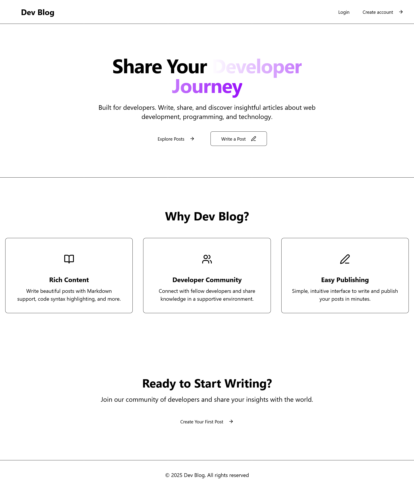

# MERN Stack Blog Application

A full-stack blog application built with the MERN stack (MongoDB, Express.js, React.js, Node.js) that demonstrates seamless integration between front-end and back-end components.



## Project Overview

This application is a comprehensive blog platform featuring user authentication, post management, categorization, and commenting functionality. It showcases modern web development practices with a clean architecture separating concerns between client and server.

### Key Technologies

- **Frontend**: React 19, Vite, React Router, Tailwind CSS, Radix UI, React Query
- **Backend**: Node.js, Express.js, MongoDB, Mongoose
- **Authentication**: JWT tokens with bcrypt password hashing
- **Development**: ESLint, Jest for testing, Nodemon for development

## Features Implemented

### Core Features

- **User Authentication**: Registration, login, and JWT-based authentication
- **Blog Post Management**: Create, read, update, delete (CRUD) operations for blog posts
- **Categories**: Organize posts by categories with automatic slug generation
- **Comments**: Add comments to blog posts
- **Search & Filtering**: Search posts by title/excerpt and filter by category
- **Responsive Design**: Mobile-first design with Tailwind CSS
- **Dark/Light Theme**: Theme toggle functionality

### Advanced Features

- **Pagination**: Efficient loading of posts with pagination
- **Image Uploads**: Support for featured images on posts
- **Role-based Access**: Admin and user roles with different permissions
- **API Documentation**: Comprehensive REST API endpoints
- **Error Handling**: Robust error handling on both client and server
- **Loading States**: Proper loading indicators and error states
- **Optimistic UI Updates**: Enhanced user experience with immediate feedback

## Project Structure

```
mern-stack-integration-vinolago/
├── client/                          # React frontend
│   ├── public/                      # Static assets
│   ├── src/
│   │   ├── api/                     # Axios configuration
│   │   ├── components/              # Reusable UI components
│   │   │   ├── auth/                # Authentication components
│   │   │   ├── layout/              # Layout components
│   │   │   └── ui/                  # UI library components
│   │   ├── context/                 # React context providers
│   │   ├── hooks/                   # Custom React hooks
│   │   ├── lib/                     # Utility functions
│   │   ├── pages/                   # Page components
│   │   ├── services/                # API service functions
│   │   └── config/                  # Configuration files
│   ├── package.json
│   └── vite.config.js
├── server/                          # Express.js backend
│   ├── config/                      # Database configuration
│   ├── controllers/                 # Route controllers (empty)
│   ├── middleware/                  # Custom middleware
│   ├── models/                      # Mongoose models
│   ├── routes/                      # API routes
│   ├── utils/                       # Utility functions
│   ├── tests/                       # Test files
│   ├── package.json
│   └── server.js                    # Main server file
└── README.md                        # Project documentation
```

## Setup Instructions

### Prerequisites

- Node.js (v18 or higher)
- MongoDB (local installation or MongoDB Atlas)
- npm or yarn package manager

### Installation

1. **Clone the repository**

   ```bash
   git clone <repository-url>
   cd mern-stack-integration-vinolago
   ```

2. **Set up the server**

   ```bash
   cd server
   npm install
   ```

3. **Set up the client**

   ```bash
   cd ../client
   npm install
   ```

4. **Environment Configuration**

   **Server Environment (.env)**

   ```env
   NODE_ENV=development
   PORT=5000
   MONGO_URI=mongodb://localhost:27017/mern-blog
   JWT_SECRET=your-super-secret-jwt-key-here
   ```

   **Client Environment (.env)**

   ```env
   VITE_API_URL=http://localhost:5000
   ```

5. **Start MongoDB**
   Make sure MongoDB is running on your system.

6. **Start the development servers**

   **Terminal 1 - Server**

   ```bash
   cd server
   npm run dev
   ```

   **Terminal 2 - Client**

   ```bash
   cd client
   npm run dev
   ```

7. **Access the application**
   - Frontend: http://localhost:5173
   - Backend API: http://localhost:5000

## API Documentation

### Authentication Endpoints

#### POST /api/auth/register

Register a new user account.

**Request Body:**

```json
{
  "name": "John Doe",
  "email": "john@example.com",
  "password": "password123"
}
```

**Response:**

```json
{
  "success": true,
  "token": "jwt-token-here",
  "user": {
    "id": "user-id",
    "name": "John Doe",
    "email": "john@example.com",
    "role": "user"
  }
}
```

#### POST /api/auth/login

Authenticate user login.

**Request Body:**

```json
{
  "email": "john@example.com",
  "password": "password123"
}
```

**Response:**

```json
{
  "success": true,
  "token": "jwt-token-here",
  "user": {
    "id": "user-id",
    "name": "John Doe",
    "email": "john@example.com"
  }
}
```

#### GET /api/auth/me

Get current authenticated user information.

**Headers:**

```
Authorization: Bearer <jwt-token>
```

**Response:**

```json
{
  "success": true,
  "data": {
    "_id": "user-id",
    "name": "John Doe",
    "email": "john@example.com",
    "role": "user"
  }
}
```

### Posts Endpoints

#### GET /api/posts

Retrieve all blog posts with optional filtering and pagination.

**Query Parameters:**

- `page` (number): Page number for pagination (default: 1)
- `limit` (number): Number of posts per page (default: 10)
- `category` (string): Filter by category ID
- `author` (string): Filter by author ID
- `tag` (string): Filter by tag
- `sort` (string): Sort order (default: '-createdAt')

**Response:**

```json
{
  "success": true,
  "count": 10,
  "total": 25,
  "page": 1,
  "data": [
    {
      "_id": "post-id",
      "title": "Sample Post",
      "content": "Post content...",
      "excerpt": "Post excerpt...",
      "featuredImage": "image-url",
      "slug": "sample-post",
      "author": {
        "_id": "author-id",
        "name": "John Doe",
        "email": "john@example.com"
      },
      "category": {
        "_id": "category-id",
        "name": "Technology",
        "slug": "technology"
      },
      "tags": ["tech", "javascript"],
      "isPublished": true,
      "viewCount": 0,
      "comments": [],
      "createdAt": "2025-10-25T09:00:00.000Z",
      "updatedAt": "2025-10-25T09:00:00.000Z"
    }
  ],
  "totalPages": 3
}
```

#### GET /api/posts/:id

Retrieve a specific blog post by ID.

**Response:**

```json
{
  "success": true,
  "data": {
    "_id": "post-id",
    "title": "Sample Post",
    "content": "Full post content...",
    "excerpt": "Post excerpt...",
    "featuredImage": "image-url",
    "slug": "sample-post",
    "author": {
      "_id": "author-id",
      "name": "John Doe"
    },
    "category": {
      "_id": "category-id",
      "name": "Technology",
      "slug": "technology"
    },
    "tags": ["tech", "javascript"],
    "isPublished": true,
    "viewCount": 0,
    "comments": [
      {
        "user": {
          "_id": "user-id",
          "name": "Jane Smith"
        },
        "content": "Great post!",
        "createdAt": "2025-10-25T10:00:00.000Z"
      }
    ],
    "createdAt": "2025-10-25T09:00:00.000Z",
    "updatedAt": "2025-10-25T09:00:00.000Z"
  }
}
```

#### POST /api/posts

Create a new blog post.

**Headers:**

```
Authorization: Bearer <jwt-token>
```

**Request Body:**

```json
{
  "title": "New Blog Post",
  "content": "Full post content here...",
  "excerpt": "Brief excerpt of the post",
  "category": "Technology",
  "featuredImage": "image-url",
  "tags": ["tech", "tutorial"],
  "isPublished": true
}
```

**Response:**

```json
{
  "success": true,
  "data": {
    "_id": "new-post-id",
    "title": "New Blog Post",
    "content": "Full post content here...",
    "excerpt": "Brief excerpt of the post",
    "category": "category-id",
    "featuredImage": "image-url",
    "slug": "new-blog-post",
    "author": "author-id",
    "tags": ["tech", "tutorial"],
    "isPublished": true,
    "viewCount": 0,
    "comments": [],
    "createdAt": "2025-10-25T11:00:00.000Z",
    "updatedAt": "2025-10-25T11:00:00.000Z"
  }
}
```

#### PUT /api/posts/:id

Update an existing blog post.

**Headers:**

```
Authorization: Bearer <jwt-token>
```

**Request Body:**

```json
{
  "title": "Updated Blog Post Title",
  "content": "Updated content...",
  "excerpt": "Updated excerpt",
  "category": "Updated Category",
  "isPublished": false
}
```

**Response:**

```json
{
  "success": true,
  "data": {
    "_id": "post-id",
    "title": "Updated Blog Post Title",
    "content": "Updated content...",
    "excerpt": "Updated excerpt",
    "category": "updated-category-id",
    "isPublished": false,
    "updatedAt": "2025-10-25T12:00:00.000Z"
  }
}
```

#### DELETE /api/posts/:id

Delete a blog post (admin only).

**Headers:**

```
Authorization: Bearer <jwt-token>
```

**Response:**

```json
{
  "success": true,
  "message": "Blog post deleted successfully"
}
```

### Categories Endpoints

#### GET /api/categories

Retrieve all categories with optional filtering.

**Query Parameters:**

- `includePosts` (boolean): Include associated posts in response
- `search` (string): Search categories by name
- `slug` (string): Filter by category slug

**Response:**

```json
{
  "success": true,
  "count": 3,
  "data": [
    {
      "_id": "category-id",
      "name": "Technology",
      "slug": "technology",
      "description": "Posts related to Technology",
      "createdAt": "2025-10-25T08:00:00.000Z",
      "updatedAt": "2025-10-25T08:00:00.000Z"
    }
  ]
}
```

#### GET /api/categories/:id

Retrieve a specific category by ID.

**Query Parameters:**

- `includePosts` (boolean): Include associated posts

**Response:**

```json
{
  "success": true,
  "data": {
    "_id": "category-id",
    "name": "Technology",
    "slug": "technology",
    "description": "Posts related to Technology",
    "createdAt": "2025-10-25T08:00:00.000Z",
    "updatedAt": "2025-10-25T08:00:00.000Z"
  }
}
```

#### POST /api/categories

Create a new category.

**Request Body:**

```json
{
  "name": "New Category",
  "description": "Description of the new category"
}
```

**Response:**

```json
{
  "success": true,
  "data": {
    "_id": "new-category-id",
    "name": "New Category",
    "slug": "new-category",
    "description": "Description of the new category",
    "createdAt": "2025-10-25T13:00:00.000Z",
    "updatedAt": "2025-10-25T13:00:00.000Z"
  }
}
```

#### PUT /api/categories/:id

Update an existing category.

**Request Body:**

```json
{
  "name": "Updated Category Name",
  "description": "Updated description"
}
```

**Response:**

```json
{
  "success": true,
  "data": {
    "_id": "category-id",
    "name": "Updated Category Name",
    "slug": "updated-category-name",
    "description": "Updated description",
    "updatedAt": "2025-10-25T14:00:00.000Z"
  }
}
```

#### DELETE /api/categories/:id

Delete a category (only if no associated posts exist).

**Response:**

```json
{
  "success": true,
  "message": "Category deleted successfully"
}
```

## Database Models

### User Model

```javascript
{
  name: String (required),
  email: String (required, unique),
  password: String (required, minlength: 6, select: false),
  role: String (enum: ['user', 'admin'], default: 'user'),
  timestamps: true
}
```

### Post Model

```javascript
{
  title: String (required, maxlength: 100),
  content: String (required),
  featuredImage: String (default: 'default-post.jpg'),
  slug: String (unique),
  excerpt: String (required, maxlength: 200),
  author: ObjectId (ref: 'User'),
  category: ObjectId (ref: 'Category', required),
  tags: [String],
  isPublished: Boolean (default: false),
  viewCount: Number (default: 0),
  comments: [{
    user: ObjectId (ref: 'User'),
    content: String (required),
    createdAt: Date (default: Date.now)
  }],
  timestamps: true
}
```

### Category Model

```javascript
{
  name: String (required, unique, maxlength: 50),
  slug: String (unique),
  description: String (maxlength: 200),
  timestamps: true
}
```

## Development Scripts

### Server Scripts

```bash
npm run dev      # Start development server with nodemon
npm start        # Start production server
npm test         # Run Jest tests
npm run test:ci  # Run tests in CI mode
```

### Client Scripts

```bash
npm run dev      # Start Vite development server
npm run build    # Build for production
npm run preview  # Preview production build
npm run lint     # Run ESLint
```

## Testing

The server includes Jest tests for authentication and posts endpoints. Run tests with:

```bash
cd server
npm test
```

## Deployment

### Environment Variables for Production

Ensure the following environment variables are set in production:

**Server:**

- `NODE_ENV=production`
- `PORT=5000`
- `MONGO_URI=mongodb+srv://...` (MongoDB Atlas URI)
- `JWT_SECRET=your-production-jwt-secret`

**Client:**

- `VITE_API_URL=https://your-api-domain.com`

### Build Commands

```bash
# Build client
cd client
npm run build

# Start server in production
cd server
npm start
```

## Contributing

1. Fork the repository
2. Create a feature branch
3. Make your changes
4. Add tests if applicable
5. Submit a pull request

## License

This project is licensed under the ISC License.
